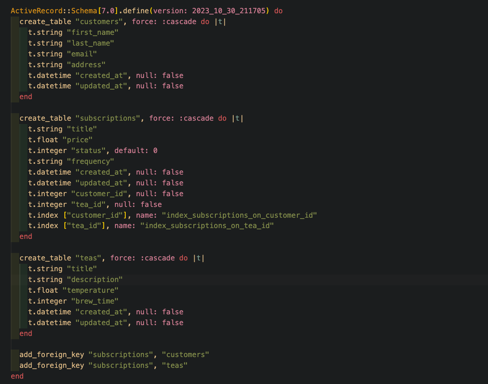

# Tea Subscription

Tea Subscription is a mock [take-home challenge](https://mod4.turing.edu/projects/take_home/take_home_be) during module 4 of Turing School of Software & Design's software engineering program, wherein the student is expected to complete the MVP in no more than 8 hours.

## About the Project
This application is a web application designed to produce APIs. The application utilizes Ruby on Rails, with a PostgrSQL database.

### Built With
- [Ruby 3.2.2](https://github.com/ruby/ruby)
- [Rails 7.0.8](https://github.com/rails/rails)
- [postgresql](https://github.com/postgres/postgres)

### Getting Started
To use Tea Subscription locally, you can fork and clone [this](https://github.com/dani-wilson/tea_subscription) repo

### Configuration
1. Clone this repo
2. cd into the directory where it was cloned and launch code editor
3. run `bundle install` to install gems and dependencies
4. Run `rails db:{create,migrate,seed}` to setup and seed the database

  ### Testing
  To test the full suite, run `bundle exec rspec`<br>
  To see a full coverage report with SimpleCov, use `open coverage/index.html`

  ## Endpoint Use
  Endpoints can be tested in Postman using localhost:3000<br>
  Endpoints are as follows:
  1. Create a tea subscription for a customer<br>
  ```
  POST /api/v0/subscriptions
  ```
  Example of a request via the body:

  

  2. Delete a customer's tea subscription:<br>
  ```
  DELETE /api/v0/subscriptions/{{subscription_id}}
  ```
    
  3. Get all tea subscriptions for a given customer<br>
  ```
  GET /api/v0/customers/{{customer_id}}/subscriptions
  ```

  ## JSON Response

  For a successful POST request:
  ```
  {
    "message": "Biweekly Orange Rooibos added."
  }
  ```
  For an unsuccessful POST request:
  ```
  {
    "errors": [
        {
            "status": "404",
            "title": "Validation failed: Customer must exist"
        }
    ]
  }
  ```
  For a successful DELETE request:
  ```
  {
    "message": "Biweekly Orange Rooibos deleted."
  }
  ```
  For an unsuccessful DELETE request:
  ```
  {
    "errors": [
        {
            "status": "404",
            "title": "Couldn't find Subscription with 'id'=100"
        }
    ]
  }
  ```
  For a successful GET request:
  ```
  [
    {
        "id": 2,
        "title": "Lifetime Matcha",
        "price": 59.79,
        "status": 1,
        "frequency": "Quinquennal",
        "created_at": "2023-11-01T16:36:03.654Z",
        "updated_at": "2023-11-01T16:36:03.654Z",
        "customer_id": 3,
        "tea_id": 15
    },
    {
        "id": 4,
        "title": "Triennal Munnar",
        "price": 33.18,
        "status": 0,
        "frequency": "Daily",
        "created_at": "2023-11-01T16:36:03.657Z",
        "updated_at": "2023-11-01T16:36:03.657Z",
        "customer_id": 3,
        "tea_id": 5
    }, etc
  ```
  For an unsuccessful GET request:
  ```
  {
    "errors": [
        {
            "status": "404",
            "title": "Couldn't find Customer with 'id'=40"
        }
    ]
  }
  ```

  ## Schema
  I chose to create three database tables: teas, customers, and subscriptions. I had thought about creating a fourth joins table, but ultimately decided it made more sense to use 'subscriptions' as a sort of joins table between customers and teas, with customer_id and tea_id being the foreign keys. Since I am a visual person, it was helpful for me to use [this website](https://www.dbdesigner.net/) to plan out my tables.
  
  <br>
  

